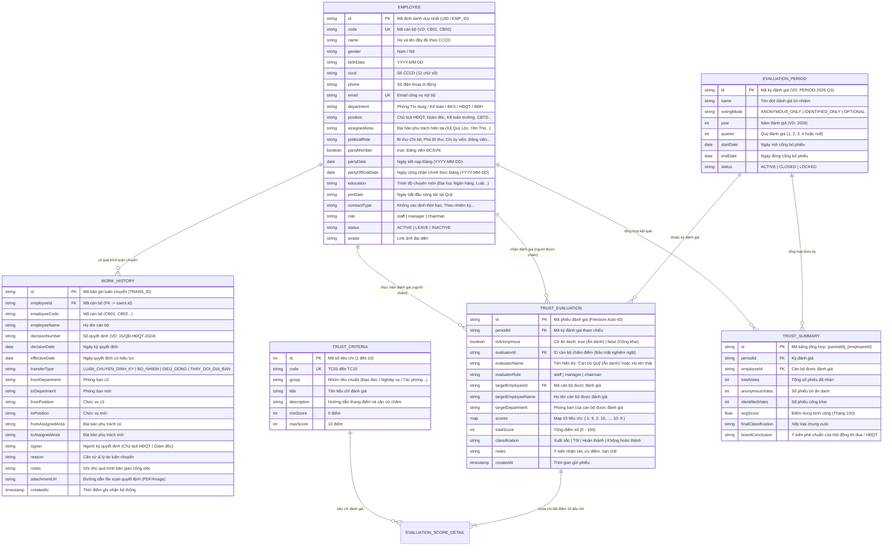

# THIẾT KẾ CƠ SỞ DỮ LIỆU: HỒ SƠ CBNV, LUÂN CHUYỂN CÔNG TÁC & ĐÁNH GIÁ TÍN NHIỆM
## QUỸ TÍN DỤNG NHÂN DÂN YÊN THỌ

> **Đơn vị áp dụng**: Quỹ Tín dụng Nhân dân Yên Thọ  
> **Địa bàn hoạt động**: Thôn Tân Lộc, xã Quý Lộc, tỉnh Thanh Hóa  
> **Cơ sở pháp lý**: 
> - Luật Các tổ chức tín dụng.
> - Quy định của Thống đốc NHNN về luân chuyển cán bộ nhằm phòng ngừa rủi ro đạo đức trong hệ thống tín dụng (đặc biệt đối với cán bộ tín dụng, kế toán, thủ quỹ).
> - Quy chế quản trị nhân sự & Quy chế bỏ phiếu tín nhiệm nội bộ QTDND Yên Thọ.

---

## 🏛️ 1. Sơ Đồ Thực Thể - Quan Hệ (ERD Diagram)



---

## 📑 2. Chi Tiết Thực Thể Mới: Quá Trình Luân Chuyển Công Tác (`work_history`)

Collection Firestore: `work_history` (hoặc Sub-collection `users/{userId}/work_history`)  
Theo chỉ đạo của Ngân hàng Nhà nước, các vị trí nhạy cảm tại Quỹ tín dụng nhân dân (CBTD, Kế toán, Thủ quỹ, BKS) **bắt buộc phải thực hiện luân chuyển định kỳ** từ 2 đến 3 năm một lần để triệt tiêu rủi ro câu kết và tiêu cực tín dụng.

### Cấu trúc dữ liệu:
| Trường dữ liệu | Kiểu dữ liệu | Ràng buộc | Ý nghĩa nghiệp vụ |
| :--- | :--- | :--- | :--- |
| `id` | `string` | **PK** | Mã định danh bản ghi luân chuyển (VD: `trans-001`). |
| `employeeId` | `string` | **FK -> users.id** | Cán bộ được điều động, luân chuyển. |
| `employeeCode` | `string` | Snapshot | Mã cán bộ (VD: `CB03`). |
| `employeeName` | `string` | Snapshot | Họ tên cán bộ. |
| `decisionNumber` | `string` | **Not Null** | Số Quyết định chính thức (VD: `18/QĐ-HĐQT-2025`). |
| `decisionDate` | `string` | `YYYY-MM-DD` | Ngày Chủ tịch HĐQT hoặc Giám đốc ký quyết định. |
| `effectiveDate` | `string` | `YYYY-MM-DD` | Ngày quyết định chính thức có hiệu lực áp dụng. |
| `transferType` | `string` | Enum chuẩn | - `LUAN_CHUYEN_DINH_KY`: Luân chuyển định kỳ phòng ngừa rủi ro NHNN<br>- `BO_NHIEM`: Bổ nhiệm chức danh mới<br>- `DIEU_DONG`: Điều động công tác giữa các phòng ban<br>- `THAY_DOI_DIA_BAN`: Luân chuyển địa bàn phụ trách tín dụng các xã |
| `fromDepartment` | `string` | Nullable | Phòng ban trước khi luân chuyển. |
| `toDepartment` | `string` | **Not Null** | Phòng ban mới tiếp nhận. |
| `fromPosition` | `string` | Nullable | Chức vụ trước khi luân chuyển. |
| `toPosition` | `string` | **Not Null** | Chức vụ mới được phân công. |
| `fromAssignedArea`| `string` | Nullable | Địa bàn tín dụng cũ (VD: "Thôn Tân Lộc, xã Quý Lộc"). |
| `toAssignedArea` | `string` | Nullable | Địa bàn tín dụng mới (VD: "Cụm 3 thôn xã Yên Thọ"). |
| `signer` | `string` | Not Null | Người ký quyết định (Chủ tịch HĐQT / Giám đốc Quỹ). |
| `reason` | `string` | Text | Căn cứ điều động (Nghị quyết HĐQT, Kế hoạch luân chuyển NHNN). |
| `handoverStatus` | `string` | Enum | `'DA_BAN_GIAO'`, `'DANG_BAN_GIAO'`, `'CHUA_BAN_GIAO'`. |
| `attachmentUrl` | `string` | Nullable | Link tệp PDF/ảnh scan quyết định lưu trữ điện tử. |
| `createdAt` | `timestamp` | Server Time | Thời điểm cập nhật vào hệ thống. |

---

## 🔒 3. Cơ Chế Đánh Giá Tín Nhiệm: Ẩn Danh vs Không Ẩn Danh

Hệ thống hỗ trợ song song cả **Bỏ phiếu kín (Ẩn danh)** và **Bỏ phiếu định danh (Công khai)** để phục vụ các mục đích quản trị khác nhau:

### 3.1. Phân biệt theo mục đích quản trị:
1. **Chế độ Ẩn Danh (`isAnonymous = true`)**:
   - **Mục đích**: Bỏ phiếu tín nhiệm thường niên, lấy phiếu tín nhiệm cán bộ nguồn để bổ nhiệm/tái bổ nhiệm chức danh HĐQT, Ban Giám đốc, Ban Kiểm soát.
   - **Tác dụng**: Cán bộ cấp dưới và đồng nghiệp tuyệt đối an tâm bày tỏ quan điểm trung thực, thẳng thắn về đạo đức và năng lực mà không sợ trù dập hoặc e dè va chạm nội bộ.
   - **Giao diện hiển thị**:
     - Người nhận đánh giá và toàn thể cán bộ **chỉ nhìn thấy nhãn**: `Cán bộ Quỹ (Ẩn danh)`.
     - Ẩn hoàn toàn `evaluatorId`, `evaluatorRole`, `evaluatorName`.
2. **Chế độ Không Ẩn Danh (`isAnonymous = false`)**:
   - **Mục đích**: Đánh giá đa chiều định kỳ hàng quý, đánh giá chéo giữa các phòng ban (Tín dụng <-> Kế toán), cấp trên đánh giá cấp dưới trực tiếp.
   - **Tác dụng**: Nêu cao tinh thần trách nhiệm của người chấm, bảo đảm tính minh bạch, có thể đối thoại và phản hồi xây dựng trực tiếp.
   - **Giao diện hiển thị**: Hiển thị rõ ràng họ tên, chức danh và phòng ban của người chấm điểm.

### 3.2. Cơ chế Bảo Mật Kép & Chống Gian Lận (Audit Trail & Double-Vote Prevention):
Một thách thức lớn của bỏ phiếu ẩn danh là: **Làm sao vừa bảo mật danh tính người chấm, vừa không cho 1 người bỏ phiếu 2 lần cho cùng 1 người?**

Cơ sở dữ liệu giải quyết triệt để vấn đề này qua kiến trúc **Bảo mật 2 tầng**:
1. **Tầng Lưu trữ & Kiểm toán (Backend Data Layer)**:
   - Bản ghi vẫn lưu trường `evaluatorId` nhưng có gắn cờ `isAnonymous: true`.
   - Cơ chế này phục vụ duy nhất 2 mục đích:
     - **Chống bỏ phiếu trùng**: Trước khi lưu phiếu mới, hệ thống truy vấn kiểm tra: `evaluatorId == currentUser.id && targetEmployeeId == target.id && periodId == period.id`. Nếu đã tồn tại thì báo lỗi *"Đồng chí đã gửi phiếu đánh giá cho nhân sự này trong kỳ hiện tại!"*.
     - **Kiểm toán tối cao (Super Audit)**: Chỉ Ban Kiểm soát độc lập hoặc Đoàn thanh tra NHNN mới có thẩm quyền giải mã khi có khiếu nại tố cáo vi phạm quy chế.
2. **Tầng Hiển thị & Truy xuất (Presentation & Query Layer)**:
   - Khi API / hàm truy vấn (`subscribeTrustEvaluations`) nạp dữ liệu:
     ```javascript
     const sanitizedList = snapshot.docs.map(doc => {
       const data = doc.data();
       if (data.isAnonymous) {
         return {
           ...data,
           id: doc.id,
           evaluatorName: "Cán bộ Quỹ (Ẩn danh)",
           evaluatorRole: "Ẩn danh",
           evaluatorId: null // Bóc tách hoàn toàn ID trước khi đẩy ra UI
         };
       }
       return { id: doc.id, ...data };
     });
     ```
   - Người được đánh giá, đồng nghiệp và màn hình Dashboard chỉ nhận được dữ liệu đã được làm sạch danh tính (anonymized payload).

---

## 📐 4. Cập Nhật Cấu Hình Đợt Đánh Giá (`evaluation_periods.votingMode`)

Người quản trị (Chủ tịch HĐQT hoặc Giám đốc) có thể thiết lập quy chế bỏ phiếu cho từng đợt:

```typescript
type VotingMode = 
  | 'ANONYMOUS_ONLY'   // Bắt buộc 100% phiếu gửi lên đều ẩn danh (Bỏ phiếu kín)
  | 'IDENTIFIED_ONLY'  // Bắt buộc 100% phiếu gửi lên phải công khai tên
  | 'OPTIONAL';        // Cho phép từng cán bộ tự tích chọn: "Ẩn danh tên tôi trên phiếu"
```

Khi ở chế độ `OPTIONAL`, trên form biểu mẫu [TrustEvaluation.jsx](file:///d:/Antigravity%20Projects/QtdYenTho-HRM/src/pages/TrustEvaluation.jsx) sẽ hiển thị một nút gạt:
> 🔘 **"Bỏ phiếu ẩn danh (Bảo mật danh tính người chấm điểm)"**  
> *Khi bật, họ tên và chức danh của bạn sẽ không xuất hiện trên phiếu đánh giá hay kết quả công bố.*

---

## 👥 5. Danh Sách 12 Cán Bộ Nhân Viên Chính Thức Đã Nạp Vào CSDL Firestore

Dữ liệu thực tế 12 CBNV đã được chuẩn hóa và nạp thành công vào Firestore (`users`), đồng thời khởi tạo tài khoản Firebase Authentication tương ứng (Mật khẩu mặc định: `Qtd@2003`, kích hoạt cờ bắt buộc đổi mật khẩu lần đầu `mustChangePassword: true`):

| TT | Mã CB | Họ và Tên | Giới tính | Chức vụ chính quyền | Phân quyền (Role) | Phòng ban | CCCD | Điện thoại | Email công vụ | Mật khẩu ban đầu |
|:---:|:---:|:---|:---:|:---|:---:|:---|:---:|:---:|:---|:---:|
| 1 | `CB01` | **Nguyễn Thị Sinh** | Nữ | Thẩm định tài sản | `staff` (Nhân viên) | Phòng Tín dụng | `038162004401` | 0388232844 | `Sinhtdyt@gmail.com` | `Qtd@2003` |
| 2 | `CB02` | **Nguyễn Thị Mến** | Nữ | Kế toán trưởng | `staff` (Nhân viên) | Phòng Kế toán - Ngân quỹ | `038183010925` | 0349547779 | `nguyenmen.yt.83@gmail.com` | `Qtd@2003` |
| 3 | `CB03` | **Nguyễn Văn Sơn** | Nam | UV HĐQT - Giám đốc | **`admin` (Quản trị viên)** | Ban Điều hành | `038080021750` | 0941562789 | `nguyenvansontdyt@gmail.com` | `Qtd@2003` |
| 4 | `CB04` | **Bùi Thị Thảo** | Nữ | Trưởng ban kiểm soát | `staff` (Nhân viên) | Ban Kiểm soát | `038182047645` | 0839062825 | `thao.bui0282@gmail.com` | `Qtd@2003` |
| 5 | `CB05` | **Nguyễn Hữu Nhân** | Nam | CB tín dụng | `staff` (Nhân viên) | Phòng Tín dụng | `038085009285` | 0949116817 | `qtdyentho.huunhan@gmail.com` | `Qtd@2003` |
| 6 | `CB06` | **Trịnh Thị Hiền** | Nữ | KST - Kiểm toán nội bộ | `staff` (Nhân viên) | Ban Kiểm soát | `038183049074` | 0948784333 | `qtdyentho.hienha@gmail.com` | `Qtd@2003` |
| 7 | `CB07` | **Trịnh Đức Anh** | Nam | Chủ tịch HĐQT | **`admin` (Quản trị viên)** | Hội đồng Quản trị | `038086010115` | 0965122111 | `ducanht@gmail.com` | `Qtd@2003` |
| 8 | `CB08` | **Vũ Thị Hiền** | Nữ | UV HĐQT | `staff` (Nhân viên) | Hội đồng Quản trị | `038186037786` | 0983502181 | `qtdyentho.vuhien@gmail.com` | `Qtd@2003` |
| 9 | `CB09` | **Trần Như Huyền** | Nữ | CB tín dụng | `staff` (Nhân viên) | Phòng Tín dụng | `038189039532` | 0985709609 | `Huyennhutran@gmail.com` | `Qtd@2003` |
| 10 | `CB10` | **Hoàng Thị Lan** | Nữ | Kế toán viên | `staff` (Nhân viên) | Phòng Kế toán - Ngân quỹ | `038189040044` | 0965178666 | `hoanglan1289@gmail.com` | `Qtd@2003` |
| 11 | `CB11` | **Phạm Thị Thảo** | Nữ | Thủ quỹ | `staff` (Nhân viên) | Phòng Kế toán - Ngân quỹ | `038190051894` | 0965567596 | `qtdyentho.phamthao@gmail.com` | `Qtd@2003` |
| 12 | `CB12` | **Lưu Thị Định** | Nữ | CB tín dụng | `staff` (Nhân viên) | Phòng Tín dụng | `038189028302` | 0961007855 | `qtdyentho.luudinh@gmail.com` | `Qtd@2003` |

### 🔐 5.1. Chính Sách Đăng Nhập & Bảo Mật Mật Khẩu Lần Đầu
- **Loại bỏ Đăng nhập nhanh**: Trang Login tuyệt đối không hiển thị nút hoặc khối đăng nhập nhanh/tài khoản mẫu để phòng ngừa rủi ro bảo mật thông tin.
- **Phân quyền Chuẩn**: 
  - Tài khoản Chủ tịch HĐQT (`CB07`) và Giám đốc (`CB03`) giữ vai trò `admin` (toàn quyền hệ thống).
  - Tất cả các cán bộ khác giữ vai trò `staff` (nhân viên chuyên môn theo chức năng phân hệ).
- **Yêu cầu đổi mật khẩu sau lần đăng nhập đầu tiên**:
  - Toàn bộ tài khoản khởi tạo với mật khẩu mặc định `Qtd@2003` đều có trường `mustChangePassword: true`.
  - Khi đăng nhập thành công vào hệ thống lần đầu, cửa sổ pop-up modal `ForceChangePasswordModal` sẽ kích hoạt, yêu cầu thiết lập mật khẩu riêng (tối thiểu 6 ký tự, khác `Qtd@2003`).
  - Sau khi xác nhận thành công, hệ thống cập nhật đồng bộ lên Firebase Auth và Firestore `users/{userId}` với `mustChangePassword: false`.

> **Ghi chú về các thông tin còn thiếu**: Các trường ngày sinh chi tiết, trình độ học vấn, ảnh chân dung thực tế và hồ sơ gia đình sẽ được bổ sung trực tiếp trên màn hình Quản lý hồ sơ cán bộ khi có đầy đủ hồ sơ văn bản.

---

## 🗄️ 6. Bảng Cấu Hình Riêng Biệt Cho Từng Đợt Đánh Giá (`period_configs`)

Để đảm bảo tính độc lập tuyệt đối giữa các đợt đánh giá tín nhiệm (**Zero Shared Config Drift**), mỗi đợt khi được tạo hoặc tinh chỉnh sẽ sở hữu một bản ghi cấu hình riêng trong collection `period_configs` tương ứng với `periodId`:

### Cấu trúc collection: `period_configs/{periodId}`
| Trường dữ liệu | Kiểu | Ý nghĩa nghiệp vụ |
| :--- | :--- | :--- |
| `id` / `periodId` | `string` (PK) | Mã đợt đánh giá tham chiếu (VD: `PERIOD-2026-Q4-8848`). |
| `periodName` | `string` | Tên hiển thị của đợt đánh giá. |
| `votingMode` | `string` | `'ANONYMOUS'` (Bỏ phiếu kín) hoặc `'IDENTIFIED'` (Công khai). |
| `allowSelfEvaluation` | `boolean` | Cho phép cán bộ tự đánh giá chính mình hay không (Mặc định: `false`). |
| `excellentThreshold` | `number` | Ngưỡng điểm đạt Hoàn thành xuất sắc nhiệm vụ (Mặc định: 90 điểm). |
| `excellentMinCrit` | `number` | Điều kiện bắt buộc Xuất sắc: Không có tiêu chí nào dưới ngưỡng này (Mặc định: 7 điểm). |
| `goodThreshold` | `number` | Ngưỡng điểm đạt Hoàn thành tốt nhiệm vụ (Mặc định: 70 điểm). |
| `goodMinCrit` | `number` | Điều kiện bắt buộc Tốt: Không có tiêu chí nào dưới ngưỡng này (Mặc định: 5 điểm). |
| `passThreshold` | `number` | Ngưỡng điểm Hoàn thành nhiệm vụ (Mặc định: 50 điểm). |
| `weakVotesThresholdPercent` | `number` | Ngưỡng % số phiếu Yếu (<=50đ) dẫn đến Không hoàn thành (Mặc định: 50%). |
| `scale` | `number` | Thang điểm quy đổi chuẩn (100). |
| `voterEmployeeIds` | `string[]` | Danh sách cán bộ được tham gia bỏ phiếu (Cử tri) trong đợt này. |
| `targetEmployeeIds` | `string[]` | Danh sách cán bộ áp dụng lấy phiếu tín nhiệm (Đối tượng) trong đợt này. |
| `criteria` | `Array<Criterion>` | Bộ tiêu chí và thang điểm áp dụng riêng cho đợt này. |
| `updatedAt` | `timestamp` | Thời gian cập nhật cấu hình lần gần nhất. |

---


## ⚙️ 7. Module Trung Tâm Khởi Tạo & Cập Nhật CSDL Tự Động (`autoInitDb.js`)

Hệ thống tích hợp Module Khởi tạo & Đồng bộ CSDL tự động tại `src/lib/autoInitDb.js` và giao diện điều khiển `AutoInitDbModal.jsx`:

### 7.1. Cơ chế Tự Động Chữa Lành & Đồng Bộ Phiên Bản (Self-Healing Schema):
- **Cơ chế hoạt động**: Mỗi khi ứng dụng khởi chạy, hàm `autoSyncDatabaseSchema()` tự động kiểm tra `CURRENT_SCHEMA_VERSION` với `system_metadata/schema`.
- **Đồng bộ tự động**: Nếu phát hiện thiếu bảng mới (ví dụ: `period_configs`, `system_settings`), hệ thống tự động khởi tạo và nạp dữ liệu chuẩn mực mà **không làm mất dữ liệu hiện hữu** (merge: true).
- **Phân hệ điều khiển**: Người quản trị có thể kích hoạt thủ công từ Navbar hoặc Launcher qua modal *"Trung Tâm Khởi Tạo & Cập Nhật CSDL Tự Động"* để ép buộc đồng bộ (`force = true`).

### 7.2. Quy Định Cập Nhật CSDL Bắt Buộc (Mandatory In-Sync Documentation):
- Mỗi khi có sự thay đổi về cấu trúc bảng hoặc thêm bảng mới trong Firestore:
  1. **Cập nhật mã nguồn**: Khai báo bảng mới trong `CORE_COLLECTIONS`, bổ sung logic vào cả `autoSyncDatabaseSchema` và `autoInitializeFirebaseDatabase` trong `src/lib/autoInitDb.js`.
  2. **Nâng phiên bản**: Tăng `CURRENT_SCHEMA_VERSION` (VD: `2026.10.09_v3.4_...`).
  3. **Cập nhật tài liệu**: Bổ sung đặc tả schema chi tiết vào `docs/DATABASE_SCHEMA_HRM_TRUST.md` trong cùng phiên làm việc và cùng commit Git.


