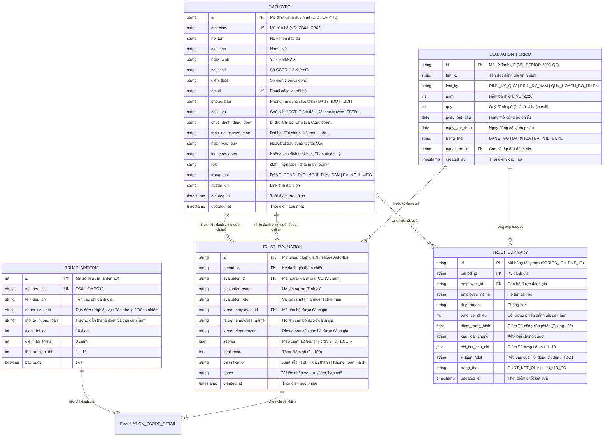

# THIẾT KẾ CƠ SỞ DỮ LIỆU: HỒ SƠ CBNV & PHÂN HỆ ĐÁNH GIÁ TÍN NHIỆM
## QUỸ TÍN DỤNG NHÂN DÂN YÊN THỌ

> **Đơn vị áp dụng**: Quỹ Tín dụng Nhân dân Yên Thọ  
> **Địa bàn hoạt động**: Thôn Tân Lộc, xã Quý Lộc, tỉnh Thanh Hóa  
> **Cơ sở pháp lý**: Luật Các tổ chức tín dụng, Thông tư của NHNN quy định về tổ chức và hoạt động của Quỹ tín dụng nhân dân, Điều lệ và Quy chế quản trị nội bộ QTDND Yên Thọ.

---

## 🏛️ 1. Sơ Đồ Thực Thể - Quan Hệ (ERD Diagram)



---

## 📑 2. Từ Điển Dữ Liệu Chi Tiết (Data Dictionary)

### BẢNG 1: `users` / `employees` (Hồ Sơ Cán Bộ Nhân Viên)
Collection Firestore: `users`  
Lưu trữ toàn bộ hồ sơ trích ngang, chức danh nghiệp vụ và tài khoản đăng nhập của nhân sự Quỹ TDND Yên Thọ.

| Tên trường (Field) | Kiểu dữ liệu | Bắt buộc | Ràng buộc / Giá trị mẫu | Ý nghĩa nghiệp vụ |
| :--- | :--- | :---: | :--- | :--- |
| `id` / `uid` | `string` | **Có** | Firebase Auth UID hoặc `emp-xxx` | Khóa chính duy nhất định danh người dùng. |
| `ma_cbnv` / `code` | `string` | **Có** | `CB01`, `CB02`... | Mã định danh nội bộ trong hồ sơ nhân sự. |
| `ho_ten` / `name` | `string` | **Có** | Max 100 ký tự (VD: "Lê Đình Hải") | Họ và tên đầy đủ theo CCCD. |
| `gioi_tinh` | `string` | Không | `'Nam'`, `'Nữ'` | Giới tính cán bộ. |
| `ngay_sinh` | `string` | Không | `YYYY-MM-DD` (VD: `1982-05-18`) | Ngày tháng năm sinh. |
| `so_cccd` | `string` | Không | 12 chữ số | Số thẻ CCCD / Mã định danh công dân. |
| `email` | `string` | **Có** | Chuẩn RFC 5322 (VD: `canbo@qtdyentho.vn`) | Email công vụ dùng để đăng nhập. |
| `dien_thoai` / `phone` | `string` | Không | 10 số (VD: `0912.345.678`) | Số điện thoại liên hệ công tác. |
| `phong_ban` / `department` | `string` | **Có** | Thuộc danh mục 5 phòng ban | Bộ phận công tác tại QTDND Yên Thọ. |
| `chuc_vu` / `position` | `string` | **Có** | VD: "Cán bộ Tín dụng chính" | Chức vụ chuyên môn được bổ nhiệm. |
| `chuc_danh_dang_doan` | `string` | Không | VD: "Bí thư Chi bộ", "Chủ tịch CĐ" | Chức vụ đoàn thể, chính trị. |
| `trinh_do_chuyen_mon` | `string` | Không | VD: "Đại học Ngân hàng" | Bằng cấp chuyên môn cao nhất. |
| `ngay_vao_quy` | `string` | Không | `YYYY-MM-DD` | Ngày bắt đầu làm việc tại Quỹ. |
| `role` | `string` | **Có** | `'staff'`, `'manager'`, `'chairman'` | Phân quyền truy cập hệ thống (RBAC). |
| `trang_thai` / `status` | `string` | **Có** | `'ACTIVE'`, `'INACTIVE'`, `'LEAVE'` | Trạng thái công tác hiện tại. |
| `avatar` | `string` | Không | URL hình ảnh | Đường dẫn ảnh chân dung cán bộ. |
| `created_at` | `timestamp` | **Có** | Thời gian máy chủ | Thời điểm tạo hồ sơ. |

---

### BẢNG 2: `trust_criteria` (Danh Mục 10 Tiêu Chí Đánh Giá Chuẩn)
Collection Firestore: `trust_criteria` (hoặc cấu hình tĩnh chuẩn hóa)  
Quy chuẩn hóa 10 tiêu chí theo Thông tư NHNN & Tiêu chuẩn thi đua nội bộ:

| Mã | Tên Tiêu Chí | Nhóm Tiêu Chuẩn | Thang Điểm | Nội Dung Hướng Dẫn & Căn Cứ Đánh Giá |
| :---: | :--- | :--- | :---: | :--- |
| **TC01** | Tinh thần trách nhiệm & Đạo đức nghề nghiệp | Phẩm chất đạo đức | $0 - 10$ | Tận tụy với công việc, trung thực, có tinh thần trách nhiệm cao, giữ gìn uy tín thương hiệu của Quỹ tín dụng. |
| **TC02** | Chấp hành Quy chế, Nội quy & Pháp luật NHNN | Tuân thủ pháp luật | $0 - 10$ | Chấp hành nghiêm ngặt quy trình nghiệp vụ tín dụng, kế toán, an toàn kho quỹ và các văn bản chỉ đạo của NHNN. |
| **TC03** | Năng lực chuyên môn & Nghiệp vụ chuyên sâu | Chuyên môn nghiệp vụ | $0 - 10$ | Am hiểu quy trình tác nghiệp, xử lý hồ sơ nhanh chóng, chuẩn xác, hạn chế tối đa sai sót rủi ro vận hành. |
| **TC04** | Tác phong giao dịch & Văn hóa phục vụ thành viên | Văn hóa giao dịch | $0 - 10$ | Ân cần, niềm nở, lịch thiệp khi tiếp xúc thành viên và khách hàng vay/gửi vốn, không quan liêu, hách dịch. |
| **TC05** | Tinh thần đoàn kết & Phối hợp phòng ban | Xây dựng tập thể | $0 - 10$ | Tương trợ đồng nghiệp, phối hợp nhịp nhàng giữa Tín dụng, Kế toán, Kiểm soát và Ban điều hành. |
| **TC06** | Kỷ luật giờ giấc & Bảo mật thông tin tài chính | Kỷ luật nội bộ | $0 - 10$ | Chấp hành thời giờ làm việc, bảo quản tài liệu lưu trữ, giữ bí mật tuyệt đối số dư tiền gửi và hồ sơ khách hàng. |
| **TC07** | Đổi mới sáng tạo & Chuyển đổi số | Đổi mới & Cải tiến | $0 - 10$ | Chủ động làm chủ phần mềm quản lý, ứng dụng công nghệ trong tác nghiệp, có giải pháp cải tiến hiệu quả. |
| **TC08** | Liêm chính tài chính & Phòng ngừa rủi ro đạo đức | Liêm chính tài chính | $0 - 10$ | Minh bạch tiền tệ, tuyệt đối không vòi vĩnh chi phí ngoài quy định, không thông đồng trục lợi tín dụng. |
| **TC09** | Đóng góp phong trào & Văn hóa tổ chức | Phong trào đơn vị | $0 - 10$ | Nhiệt tình tham gia các hoạt động an sinh xã hội, phong trào công đoàn, xây dựng đơn vị vững mạnh. |
| **TC10** | Hiệu quả hoàn thành chỉ tiêu công việc | Kết quả công tác | $0 - 10$ | Hoàn thành và hoàn thành vượt mức các chỉ tiêu được giao về dư nợ, huy động vốn, kiểm soát nợ quá hạn. |

---

### BẢNG 3: `evaluations_trust` (Phiếu Đánh Giá Tín Nhiệm Chi Tiết)
Collection Firestore: `evaluations_trust`  
Lưu trữ từng phiếu bầu / phiếu chấm điểm thực tế do một cán bộ thực hiện đối với một cán bộ khác.

| Tên trường (Field) | Kiểu dữ liệu | Ràng buộc | Ý nghĩa nghiệp vụ |
| :--- | :--- | :--- | :--- |
| `id` | `string` | Khóa chính tự sinh Firestore | Mã phiếu đánh giá. |
| `period_id` | `string` | Tham chiếu đợt (VD: `2026-Q3`) | Đợt đánh giá áp dụng. |
| `evaluator_id` | `string` | ID cán bộ chấm (khác `target_employee_id`) | Không được tự chấm điểm chính mình ở phân hệ này. |
| `evaluator_name` | `string` | Họ tên người chấm | Lưu snapshot hiển thị nhanh. |
| `evaluator_role` | `string` | `'staff'`, `'manager'`, `'chairman'` | Cấp bậc của người chấm điểm. |
| `target_employee_id`| `string` | ID cán bộ được đánh giá | Cán bộ thuộc danh sách nhân sự QTDND. |
| `target_employee_name`| `string` | Họ tên cán bộ nhận đánh giá | Lưu snapshot. |
| `target_department` | `string` | Phòng ban của cán bộ nhận đánh giá | Phục vụ lọc và tổng hợp báo cáo. |
| `scores` | `Map<string, number>` | 10 cặp key-value (`1` đến `10`), mỗi giá trị $\in [0, 10]$ | Điểm số cụ thể của từng tiêu chí. |
| `total_score` | `number` | Tính tự động $= \sum_{i=1}^{10} \text{scores}[i]$ (Phạm vi $0 - 100$) | Tổng điểm tín nhiệm của phiếu. |
| `classification` | `string` | Tự động phân loại dựa trên `total_score` | `'Xuất sắc'`, `'Tốt'`, `'Hoàn thành'`, `'Không hoàn thành'`. |
| `notes` | `string` | Tối đa 1.000 ký tự | Ý kiến nhận xét, đóng góp riêng. |
| `created_at` | `string` / `timestamp` | ISO 8601 String & Firestore ServerTimestamp | Thời điểm ghi nhận phiếu. |

---

### BẢNG 4: `trust_evaluation_summaries` (Bảng Tổng Hợp Tín Nhiệm Định Kỳ)
Collection Firestore: `trust_summaries`  
Bảng tổng hợp tự động phục vụ Hội đồng Quản trị và Ban Điều hành xem xét thi đua khen thưởng cuối kỳ.

| Tên trường (Field) | Kiểu dữ liệu | Ý nghĩa nghiệp vụ |
| :--- | :--- | :--- |
| `id` | `string` | Khóa chính ghép: `{period_id}_{employee_id}` |
| `period_id` | `string` | Kỳ đánh giá (VD: `2026-NAM`) |
| `employee_id` | `string` | ID cán bộ được tổng hợp |
| `employee_name` | `string` | Họ tên cán bộ |
| `department` | `string` | Phòng ban công tác |
| `so_luong_phieu` | `number` | Tổng số phiếu đánh giá đã thu về |
| `diem_trung_binh` | `number` | Điểm trung bình cộng: $\frac{\sum \text{total\_score}}{\text{so\_luong\_phieu}}$ |
| `diem_theo_nhom` | `Map<string, number>` | Điểm trung bình theo từng nhóm người chấm (BĐH chấm, Đồng nghiệp chấm) |
| `xep_loai_de_xuat` | `string` | Xếp loại gợi ý dựa trên điểm trung bình chung cuộc |
| `y_kien_hoi_dong` | `string` | Ý kiến phê chuẩn của Chủ tịch HĐQT / Hội đồng thi đua |
| `trang_thai` | `string` | `'DANG_TONG_HOP'`, `'DA_CHOT_SO'`, `'CONG_BO'` |

---

## 🔒 3. Quy Tắc Bảo Mật Firestore (Security Rules)

Đề xuất quy tắc áp dụng cho tệp `firestore.rules`:

```javascript
rules_version = '2';
service cloud.firestore {
  match /databases/{database}/documents {
    
    // Hàm trợ giúp kiểm tra đăng nhập & quyền hạn
    function isAuthenticated() {
      return request.auth != null;
    }
    
    function getUserRole() {
      return get(/databases/$(database)/documents/users/$(request.auth.uid)).data.role;
    }
    
    function isManagerOrChairman() {
      return isAuthenticated() && (getUserRole() == 'manager' || getUserRole() == 'chairman');
    }

    // 1. Bộ sưu tập Người dùng (users)
    match /users/{userId} {
      allow read: if isAuthenticated();
      allow write: if isManagerOrChairman();
    }

    // 2. Bộ sưu tập Đánh giá tín nhiệm (evaluations_trust)
    match /evaluations_trust/{evaluationId} {
      allow read: if isAuthenticated();
      allow create: if isAuthenticated() 
                    && request.resource.data.evaluator_id == request.auth.uid
                    && request.resource.data.target_employee_id != request.auth.uid
                    && request.resource.data.total_score >= 0 
                    && request.resource.data.total_score <= 100;
      allow update, delete: if isManagerOrChairman();
    }

    // 3. Bộ sưu tập Chấm điểm KPI (evaluations_kpi)
    match /evaluations_kpi/{kpiId} {
      allow read: if isAuthenticated();
      allow create: if isAuthenticated();
      allow update: if isAuthenticated();
    }

    // 4. Bộ sưu tập Bỏ phiếu quy hoạch (evaluations_planning)
    match /evaluations_planning/{voteId} {
      allow read: if isAuthenticated();
      allow create: if isAuthenticated();
      allow update, delete: if isManagerOrChairman();
    }
  }
}
```

---

## 📐 4. Thang Điểm & Phân Hạng Tín Nhiệm (Classification Matrix)

$$\begin{cases} 
\text{Tổng điểm} \ge 90 & \longrightarrow \mathbf{Xuất\ sắc} \quad \text{(Đề nghị khen thưởng cấp Quỹ / Liên minh HTX / NHNN)} \\
70 \le \text{Tổng điểm} < 90 & \longrightarrow \mathbf{Tốt} \quad \text{(Hoàn thành tốt nhiệm vụ, đủ điều kiện quy hoạch)} \\
50 \le \text{Tổng điểm} < 70 & \longrightarrow \mathbf{Hoàn\ thành} \quad \text{(Đạt yêu cầu định mức, cần bồi dưỡng thêm)} \\
\text{Tổng điểm} < 50 & \longrightarrow \mathbf{Không\ hoàn\ thành} \quad \text{(Kiểm điểm trách nhiệm, xem xét điều chuyển)}
\end{cases}$$
