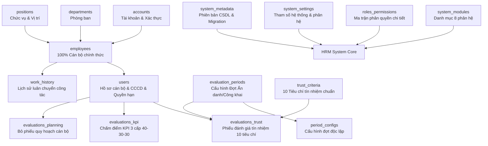

# HƯỚNG DẪN KẾT NỐI FIREBASE & TỰ ĐỘNG KHỞI TẠO CSDL TOÀN DIỆN
## Cổng Thông Tin Đánh Giá Tín Nhiệm & Quản Trị Nhân Sự — Quỹ Tín Dụng Nhân Dân Yên Thọ

> **TRẠNG THÁI HỆ THỐNG**:
> - **Firebase Project ID**: `qtdyentho-hrm`
> - **Web App ID**: `1:112031414979:web:e96098d3108638f50d4076`
> - **Phương thức Xác thực (Authentication)**: Đã kích hoạt **Email/Password** & **Google Sign-In**.
> - **Cơ sở dữ liệu (Firestore)**: Đã khởi tạo vùng `asia-southeast1` (Singapore) và triển khai `firestore.rules`.
> - **Địa chỉ truy cập trực tuyến**: `https://qtdyentho-hrm.web.app`

---

## 📋 MỤC LỤC
1. [Tổng Quan Kiến Trúc CSDL & Bảo Mật](#1-tổng-quan-kiến-trúc-csdl--bảo-mật)
2. [Cấu Hình Xác Thực Authentication (Email & Google)](#2-cấu-hình-xác-thực-authentication-email--google)
3. [Cơ Sở Dữ Liệu Cloud Firestore & Bảo Mật Rules](#3-cơ-sở-dữ-liệu-cloud-firestore--bảo-mật-rules)
4. [Kích Hoạt Khởi Tạo CSDL Tự Động 1-Click](#4-kích-hoạt-khởi-tạo-csdl-tự-động-1-click)
5. [Tạo Tài Khoản Cán Bộ & Phân Quyền Truy Cập](#5-tạo-tài-khoản-cán-bộ--phân-quyền-truy-cập)
6. [Cấu Trúc Modular & Khả Năng Mở Rộng Dài Hạn (Chấm Công, Lương)](#6-cấu-trúc-modular--khả-năng-mở-rộng-dài-hạn)

---

## 1. TỔNG QUAN KIẾN TRÚC CSDL & BẢO MẬT

Hệ thống quản lý dữ liệu trên Cloud Firestore theo 16 bộ sưu tập chuẩn hóa:



### Nguyên tắc bảo mật bỏ phiếu kín:
- **Cấu hình tại cấp Đợt**: Ban Quản trị quyết định đợt đánh giá là `ANONYMOUS` (Bỏ phiếu kín) hoặc `IDENTIFIED` (Công khai định danh).
- **Cán bộ không tự ý chọn**: Ngăn chặn rủi ro lộ lọt hoặc nể nang trong nội bộ đơn vị.
- **Bảo mật 2 tầng**: Ở tầng hiển thị, tên người chấm tự động hiển thị là `"Cán bộ Quỹ (Ẩn danh)"`. Ở tầng lưu trữ kiểm toán, hệ thống lưu mã tham chiếu chống bỏ phiếu trùng.

---

## 2. CẤU HÌNH XÁC THỰC AUTHENTICATION (EMAIL & GOOGLE)

Dự án đã được kích hoạt đồng thời 2 phương thức xác thực chuẩn doanh nghiệp:
1. **Email / Mật khẩu (Email/Password)**: Dành cho cán bộ đăng nhập bằng tài khoản nội bộ cấp bởi Quỹ (ví dụ: `canbo@qtdyentho.vn`).
2. **Đăng nhập với Google (Google Sign-In)**: Hỗ trợ cán bộ sử dụng tài khoản Gmail công vụ/cá nhân để đăng nhập an toàn 1 chạm qua cửa sổ pop-up. Khi đăng nhập lần đầu, hệ thống tự động khởi tạo hồ sơ trong collection `users` trên Firestore.

---

## BƯỚC 2: BẬT DỊCH VỤ XÁC THỰC (AUTHENTICATION)

1. Tại menu bên trái Firebase Console, chọn **Build** $\rightarrow$ **Authentication**.
2. Nhấn nút **Get started**.
3. Tại tab **Sign-in method**, chọn nhà cung cấp **Email/Password**.
4. Bật công tắc **Enable** ở dòng đầu tiên (*Email/Password*).
5. Nhấn **Save**.

---

## BƯỚC 3: TẠO CƠ SỞ DỮ LIỆU CLOUD FIRESTORE

1. Tại menu bên trái, chọn **Build** $\rightarrow$ **Firestore Database**.
2. Nhấn nút **Create database**.
3. Chọn vị trí lưu trữ (Location):
   - Khuyến nghị chọn: `asia-southeast1` (Singapore) hoặc `asia-east1` để có tốc độ truy xuất nhanh nhất từ Việt Nam.
4. Chọn chế độ bảo mật ban đầu:
   - Chọn **Start in production mode** (Bắt đầu ở chế độ sản xuất).
5. Nhấn **Create** để hoàn tất.

---

## BƯỚC 4: CẤU HÌNH QUY TẮC BẢO MẬT (FIRESTORE SECURITY RULES)

1. Trong trang **Firestore Database**, chuyển sang tab **Rules**.
2. Dán toàn bộ quy tắc phân quyền chuẩn mực dưới đây:

```javascript
rules_version = '2';
service cloud.firestore {
  match /databases/{database}/documents {
    
    // Hàm phụ trợ kiểm tra trạng thái đăng nhập
    function isAuthenticated() {
      return request.auth != null;
    }
    
    // Lấy thông tin role người dùng từ collection users
    function getUserRole() {
      return get(/databases/$(database)/documents/users/$(request.auth.uid)).data.role;
    }
    
    function isManagerOrChairman() {
      return isAuthenticated() && (getUserRole() == 'manager' || getUserRole() == 'chairman' || getUserRole() == 'admin');
    }

    // 1. Hồ sơ nhân sự: Mọi cán bộ đã đăng nhập đều có quyền xem danh bạ; chỉ Quản trị/Ban Lãnh đạo được sửa
    match /users/{userId} {
      allow read: if isAuthenticated();
      allow write: if isManagerOrChairman();
    }

    // 2. Lịch sử luân chuyển công tác: Xem công khai nội bộ; Quản trị ghi nhận quyết định
    match /work_history/{historyId} {
      allow read: if isAuthenticated();
      allow write: if isManagerOrChairman();
    }

    // 3. Tiêu chí tín nhiệm & Phân hệ hệ thống: Đọc công khai
    match /trust_criteria/{criterionId} {
      allow read: if isAuthenticated();
      allow write: if isManagerOrChairman();
    }
    match /system_modules/{moduleId} {
      allow read: if isAuthenticated();
      allow write: if isManagerOrChairman();
    }
    match /roles_permissions/{roleId} {
      allow read: if isAuthenticated();
      allow write: if isManagerOrChairman();
    }

    // 4. Đợt đánh giá: Cán bộ xem; Ban Quản trị cấu hình và quyết định Ẩn danh/Công khai
    match /evaluation_periods/{periodId} {
      allow read: if isAuthenticated();
      allow write: if isManagerOrChairman();
    }

    // 5. Phiếu đánh giá tín nhiệm: 
    // - Mọi cán bộ được gửi phiếu đánh giá cho đồng nghiệp
    // - Chỉ Ban Quản trị/Kiểm soát được xem tổng hợp toàn bộ phiếu
    match /evaluations_trust/{evalId} {
      allow read: if isAuthenticated();
      allow create: if isAuthenticated();
      allow update, delete: if isManagerOrChairman();
    }

    // 6. Đánh giá KPI 3 bước
    match /evaluations_kpi/{kpiId} {
      allow read: if isAuthenticated();
      allow create, update: if isAuthenticated();
      allow delete: if isManagerOrChairman();
    }

    // 7. Bỏ phiếu quy hoạch cán bộ
    match /evaluations_planning/{planId} {
      allow read: if isAuthenticated();
      allow create: if isAuthenticated();
      allow update, delete: if isManagerOrChairman();
    }
  }
}
```

3. Nhấn nút **Publish** (Xuất bản) để kích hoạt luật bảo mật.

---

## BƯỚC 5: LẤY MÃ CẤU HÌNH & DÁN VÀO ỨNG DỤNG

1. Tại Firebase Console, nhấn vào biểu tượng bánh răng **Project Settings** (Cài đặt dự án) ở góc trên bên trái.
2. Cuộn xuống phần **Your apps** $\rightarrow$ Chọn biểu tượng Web **`</>`**.
3. Nhập tên ứng dụng: `QtdYenTho-HRM-Web` $\rightarrow$ Nhấn **Register app**.
4. Sao chép đoạn mã `firebaseConfig` (chỉ sao chép phần nằm trong `{ ... }`):

```javascript
const firebaseConfig = {
  apiKey: "AIzaSyBxxxx...",
  authDomain: "qtd-yentho-hrm.firebaseapp.com",
  projectId: "qtd-yentho-hrm",
  storageBucket: "qtd-yentho-hrm.firebasestorage.app",
  messagingSenderId: "123456789...",
  appId: "1:123456789:web:xxxx..."
};
```

5. Mở tệp mã nguồn: `src/lib/firebase.js` trong thư mục dự án và dán đè vào đối tượng `firebaseConfig`:

```javascript
// src/lib/firebase.js
const firebaseConfig = {
  apiKey: "AIzaSyBxxxx...",
  authDomain: "qtd-yentho-hrm.firebaseapp.com",
  projectId: "qtd-yentho-hrm",
  storageBucket: "qtd-yentho-hrm.firebasestorage.app",
  messagingSenderId: "123456789...",
  appId: "1:123456789:web:xxxx..."
};
```

6. Lưu tệp (`Ctrl + S`). Ngay lập tức, ứng dụng sẽ tự động chuyển từ Chế độ Dữ liệu Nội bộ sang kết nối Đám mây Cloud Firestore!

---

## BƯỚC 6: KÍCH HOẠT KHỞI TẠO CSDL TỰ ĐỘNG 1-CLICK

Sau khi lưu cấu hình, bạn không cần phải tạo từng bảng trên Firebase Console:

1. Mở giao diện WebApp trên trình duyệt.
2. Nhìn lên góc phải thanh tiêu đề Navbar, nhấn vào nút **"⚡ Tự động CSDL"** (hoặc nút **"Khởi tạo CSDL tự động"** trên thanh thông báo).
3. Hộp thoại **"Trung Tâm Khởi Tạo & Cập Nhật CSDL Tự Động"** xuất hiện.
4. Nhấn nút: **"Tiến hành Khởi tạo & Cập nhật 16 Bảng CSDL Tự Động"**.
5. Hệ thống sẽ tự động thực thi và đồng bộ toàn bộ 16 bộ sưu tập nòng cốt:
   - ✅ `accounts`: Danh sách tài khoản đăng nhập & phân quyền chuyên biệt
   - ✅ `employees`: Danh bạ 100% Cán bộ Nhân viên chính thức (sạch tài khoản root)
   - ✅ `system_metadata`: Siêu dữ liệu phiên bản CSDL và lịch sử đồng bộ
   - ✅ `system_modules`: 8 danh mục phân hệ chức năng
   - ✅ `system_settings`: Tham số cấu hình chung & cấu hình phân hệ
   - ✅ `roles_permissions`: 4 ma trận phân quyền RBAC
   - ✅ `departments`: Danh mục phòng ban Quỹ TDND Yên Thọ
   - ✅ `positions`: Danh mục chức vụ & chức danh chuyên môn
   - ✅ `trust_criteria`: 10 tiêu chí tín nhiệm chuẩn mực NHNN
   - ✅ `evaluation_periods`: Danh mục các đợt đánh giá & lấy phiếu tín nhiệm
   - ✅ `period_configs`: Bảng cấu hình độc lập cho từng đợt đánh giá
   - ✅ `users`: Hồ sơ cán bộ nhân viên (tương thích ngược)
   - ✅ `work_history`: Quá trình luân chuyển điều động & bổ nhiệm cán bộ
   - ✅ `evaluations_trust`: Phiếu đánh giá tín nhiệm chi tiết
   - ✅ `evaluations_kpi`: Dữ liệu đánh giá hiệu quả KPI các cấp
   - ✅ `evaluations_planning`: Dữ liệu bỏ phiếu quy hoạch cán bộ nguồn
6. Sau khoảng 3 - 5 giây, thanh tiến độ đạt **100%** và bảng thống kê kết quả xuất hiện. Toàn bộ 16 bảng cơ sở dữ liệu trên Firebase Cloud Firestore đã sẵn sàng vận hành!

---

## TẠO TÀI KHOẢN CÁN BỘ & PHÂN QUYỀN TRUY CẬP

Để các cán bộ có thể đăng nhập bằng tài khoản cá nhân:

### Cách 1: Tạo trên Firebase Authentication Console
1. Truy cập **Authentication** $\rightarrow$ Tab **Users** $\rightarrow$ Nhấn **Add user**.
2. Nhập Email (VD: `canbo@qtdyentho.vn`) và Mật khẩu (VD: `Qtd123456@`).
3. Sau khi tạo user, sao chép `User UID` của người đó.
4. Mở Firestore collection `users`, tìm bản ghi tương ứng hoặc đổi ID tài liệu thành `User UID` vừa tạo để khớp hồ sơ trích ngang.

### Danh sách tài khoản mặc định được khởi tạo tự động:
| Email | Họ và tên | Chức vụ | Quyền hạn (Role) |
| :--- | :--- | :--- | :--- |
| `chutich@qtdyentho.vn` | Lê Đình Hải | Chủ tịch HĐQT | `chairman` |
| `quanly@qtdyentho.vn` | Trần Thị Mai | Giám đốc điều hành | `manager` |
| `bks@qtdyentho.vn` | Hoàng Văn Định | Trưởng Ban kiểm soát | `manager` (Thanh tra) |
| `canbo@qtdyentho.vn` | Nguyễn Văn An | Cán bộ Tín dụng | `staff` |
| `ketoan@qtdyentho.vn` | Lê Thị Bích | Kế toán trưởng | `staff` |

---

## CẤU TRÚC MODULAR & KHẢ NĂNG MỞ RỘNG DÀI HẠN

Hệ thống được thiết kế theo kiến trúc **Modular Core Architecture** với bảng định danh `system_modules` và bộ quyền `roles_permissions`.

### 1. Phân hệ đang hoạt động (ACTIVE):
- `MODULE_HR`: Quản trị Danh bạ & Quá trình Luân chuyển Cán bộ.
- `MODULE_TRUST`: Bỏ phiếu Đánh giá Tín nhiệm 10 Tiêu chí (Ẩn danh / Công khai).
- `MODULE_KPI`: Đánh giá Hiệu quả Công việc 3 Cấp (40% - 30% - 30%).
- `MODULE_PLANNING`: Bỏ phiếu Tín nhiệm Quy hoạch Cán bộ Lãnh đạo.
- `MODULE_DASHBOARD`: Bảng Điều khiển Phân tích & Giám sát Tín nhiệm.

### 2. Các phân hệ tương lai đã chuẩn bị sẵn cấu trúc CSDL (PLANNED):
- `MODULE_TIMEKEEPING`: Quản lý Chấm công, Nghỉ phép & Thời giờ làm việc.
- `MODULE_PAYROLL`: Tính Lương, Thưởng kinh doanh & Trích nộp BHXH.
- `MODULE_AWARDS`: Thi đua, Khen thưởng & Xử lý Kỷ luật lao động.

Khi đơn vị có nhu cầu phát triển thêm phân hệ Chấm công hoặc Tiền lương, chỉ cần chuyển trạng thái `status: 'ACTIVE'` trong bảng `system_modules` và gắn quyền tương ứng trong `src/lib/permissions.js` mà **không làm thay đổi hoặc xáo trộn cấu trúc CSDL hiện hữu**.

---
*Văn bản ban hành phục vụ triển khai kỹ thuật nội bộ — Quỹ Tín Dụng Nhân Dân Yên Thọ.*
